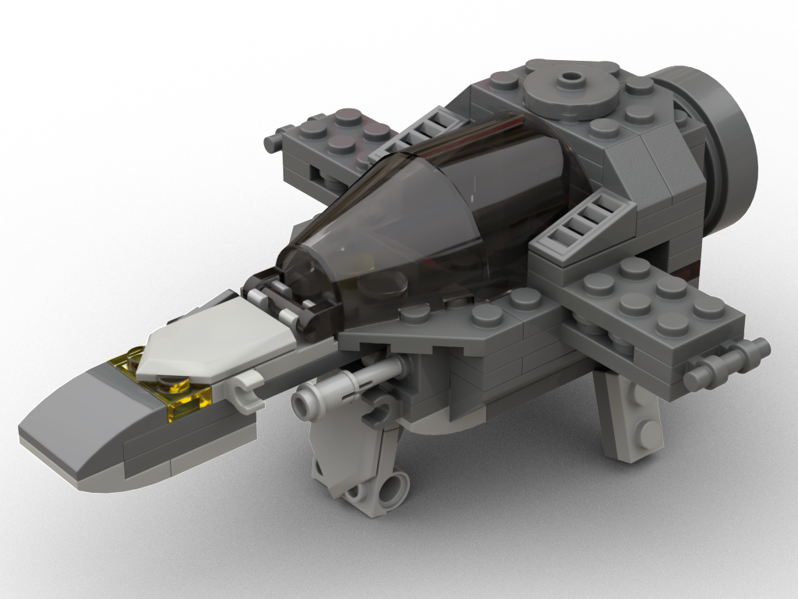
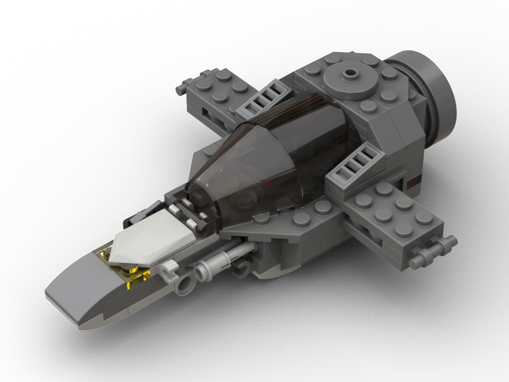
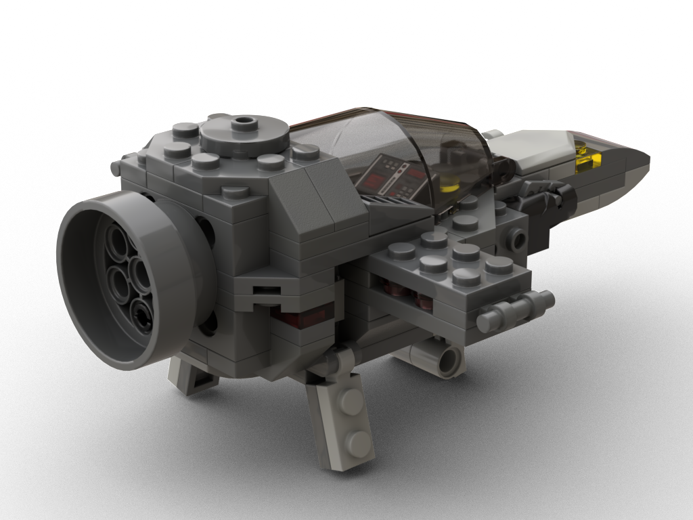
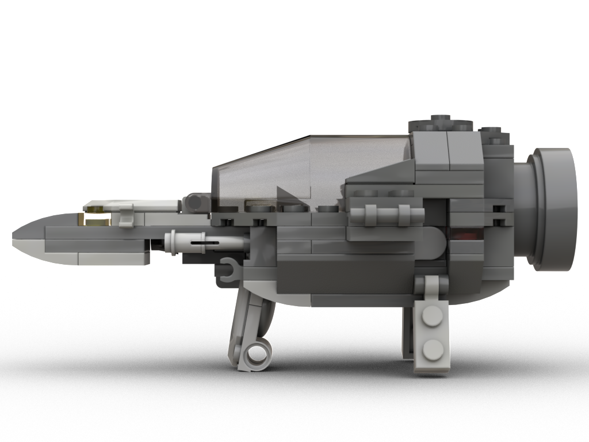
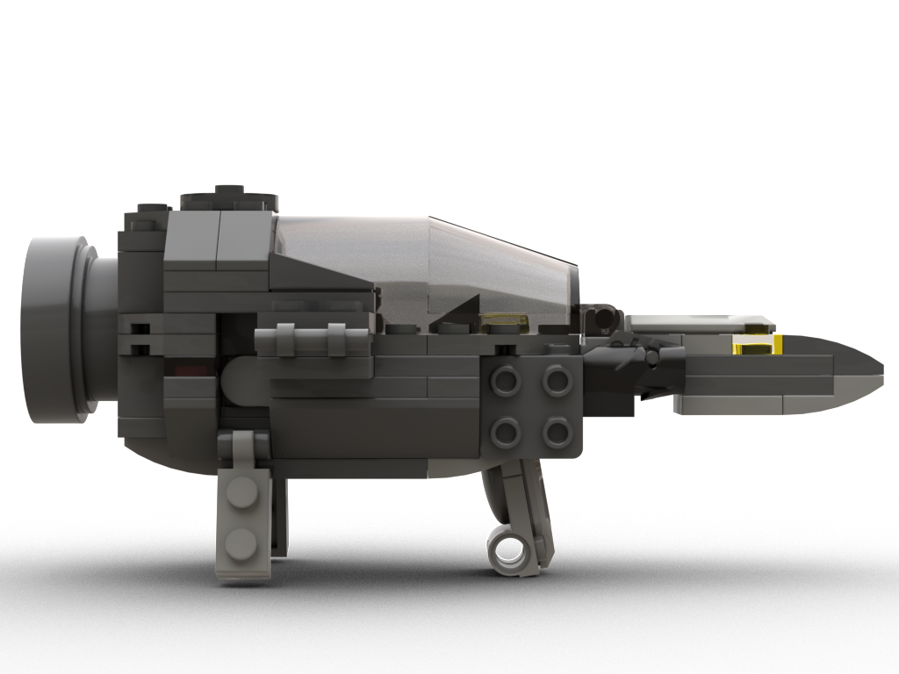
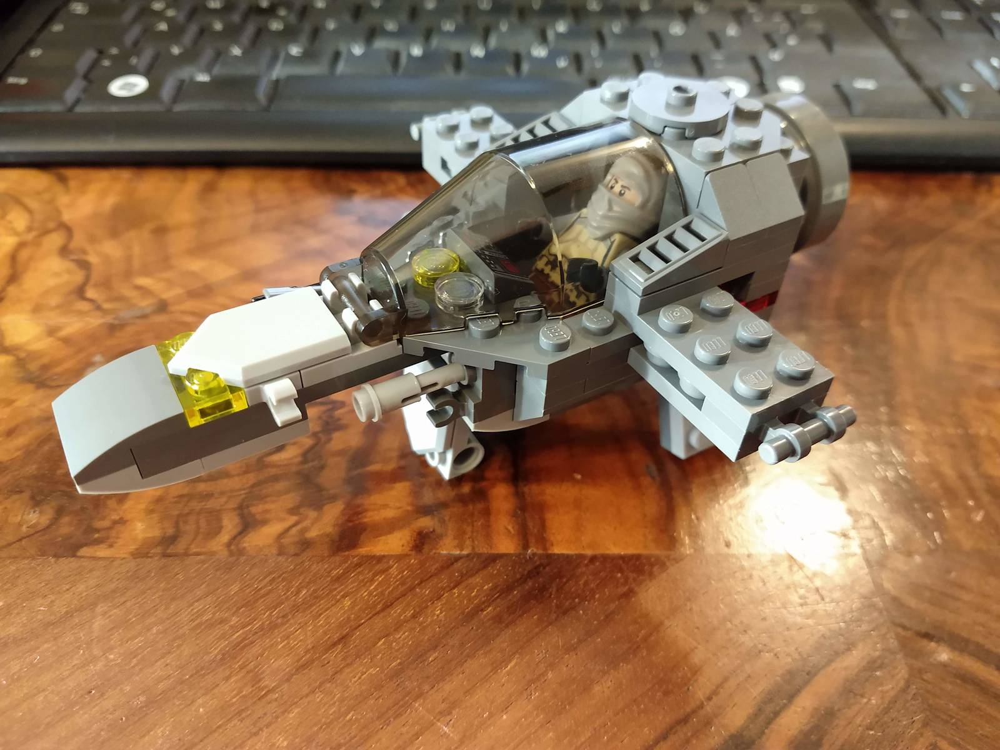
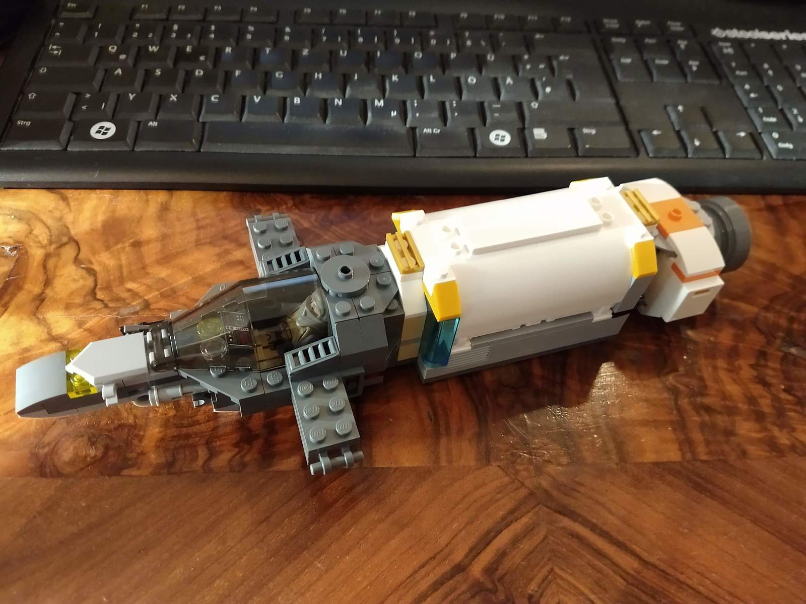
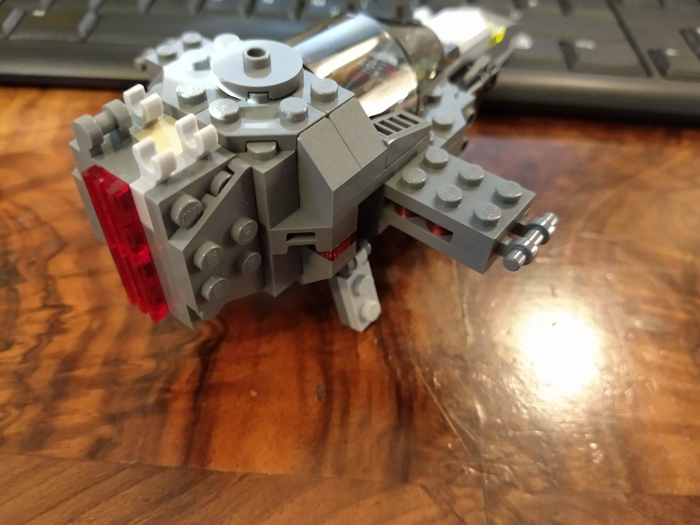
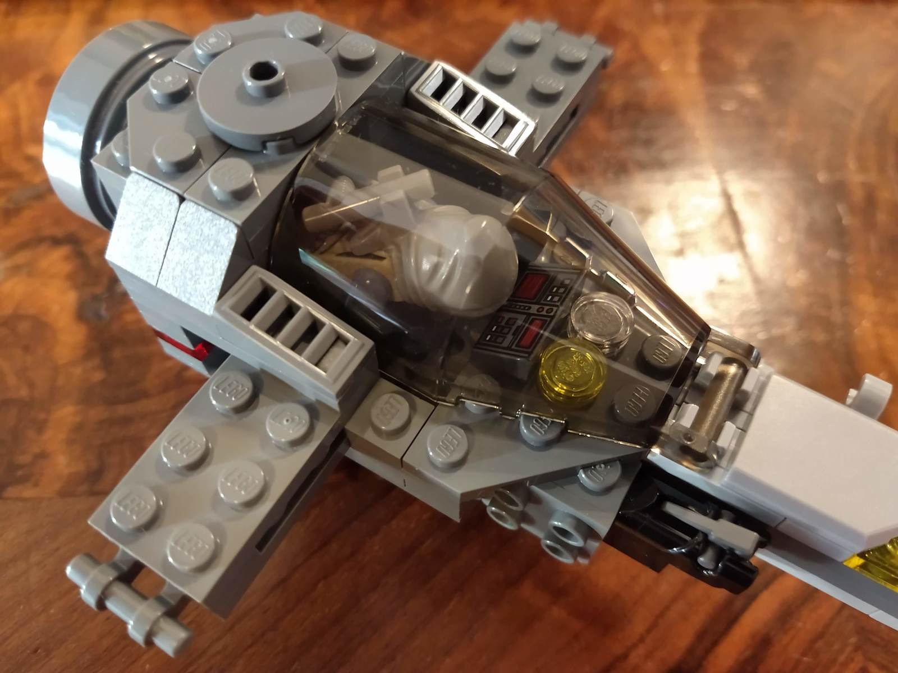
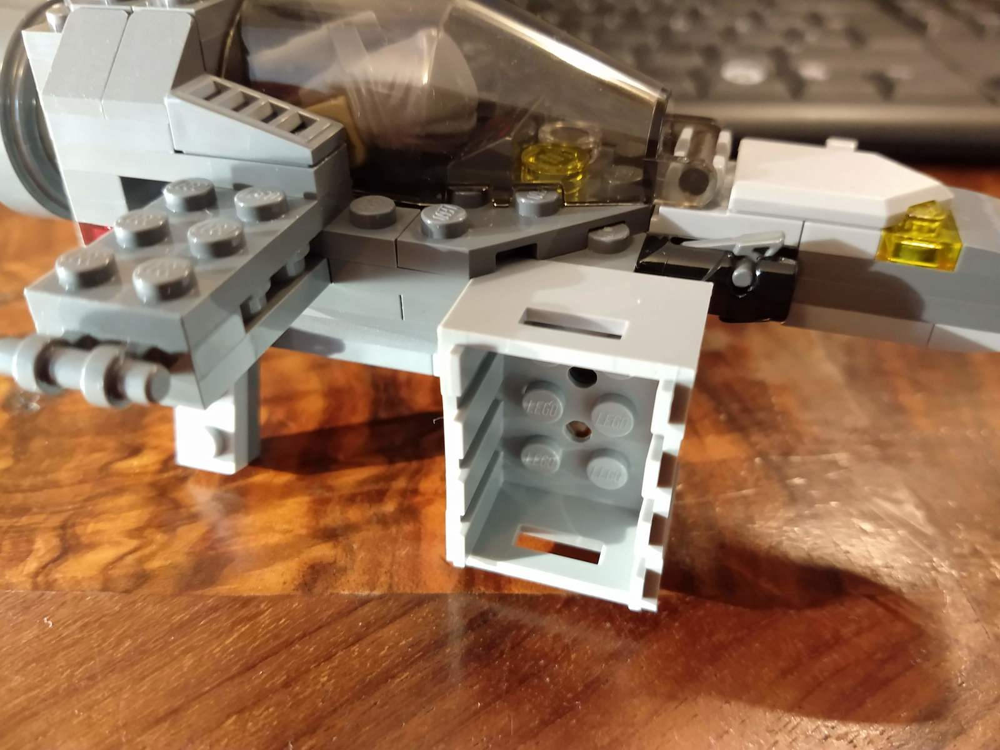

The Dagger is a light assault fighter.

[Instructions (includes part list)](the-dagger-instructions.pdf)

## Rendered images

## Features

* Limited pilot space. If the pilot figure is very bulky, it could also stand, facing downwards (see photos below)
* Window to the rear engine and docking ports
* The Needle engine also suits the ship nicely (see photos below). Room for future improvement
* Launcher and a cannon
* Extendable pedestals

## Meta

The cockpit needed lots of iteration to increase pilot space.
In the first version, the rear pedestals were hinged higher, had another design element and could not be fully submerged in the hull.
I needed to place them lower to connect the front to the rear part of the spaceship to greatly increase sturdiness.

While digitalizing the model, I ran into two opportunities to swap parts and improve stability/design, stretching the whole process.

* Dimensions: 14x11x5cm (with pedestals contracted), 71g, 112 parts, 53 distinct parts

